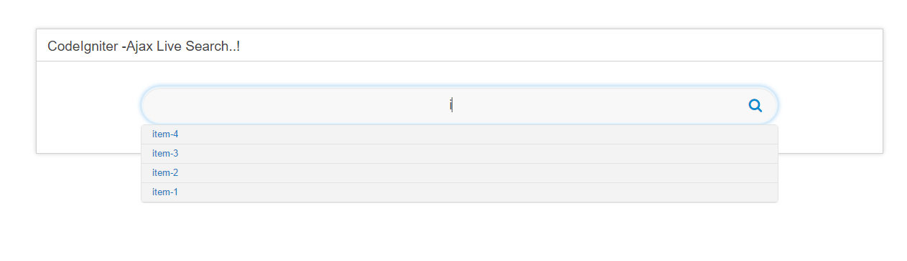

# Codeigniter-live-search
Codeigniter live search using ajax

Just clone the repo to your desktop. Change the database name to your own database name. Change the table you want to search in the model. The rest is easy.
If you do not have any knowledge of CodeIgniter, you might want to visit [https://www.tutorialspoint.com/codeigniter/].

Leave a star if it helped you and create an issue if you have one.
